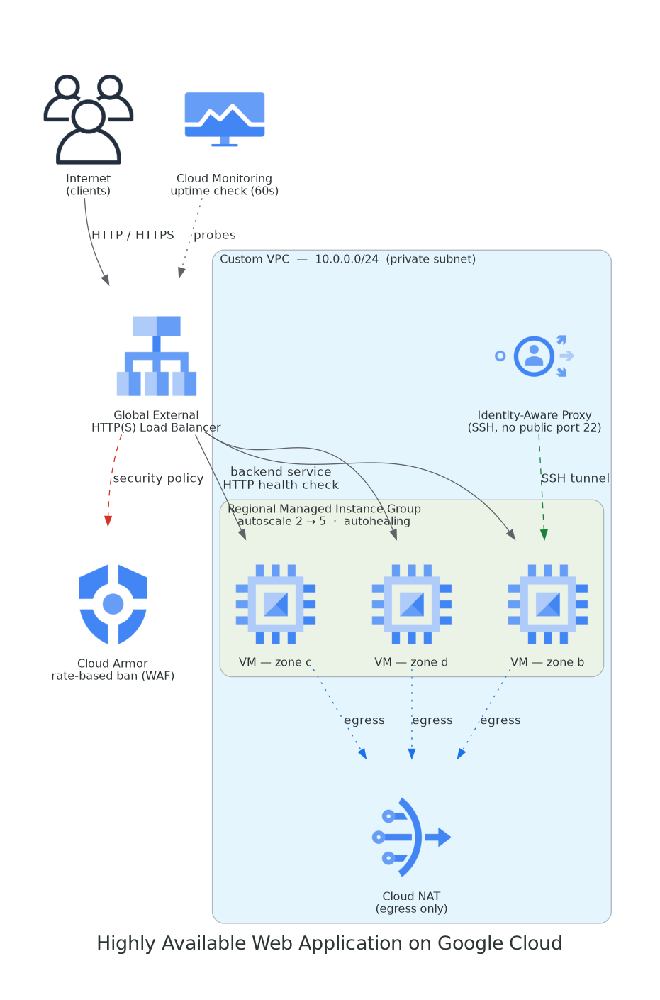
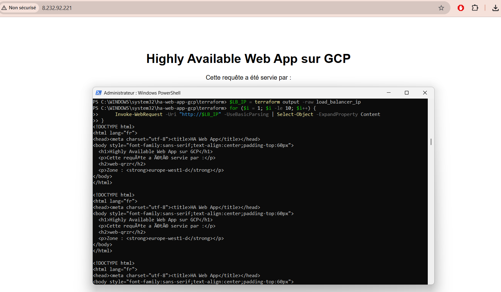
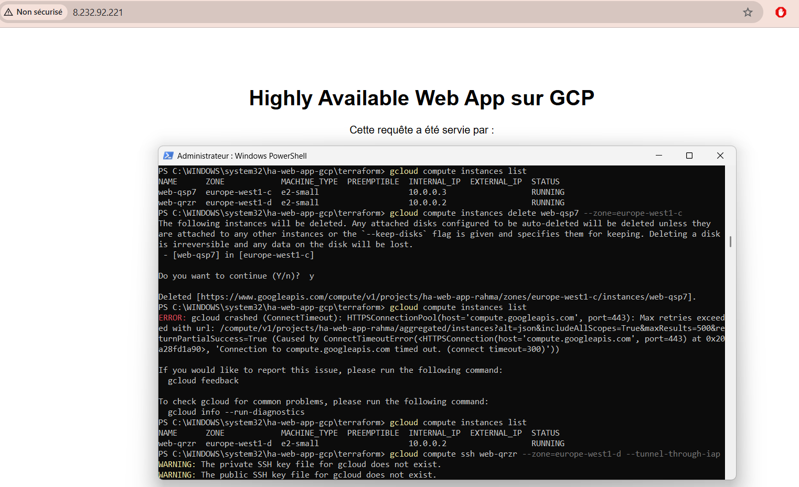
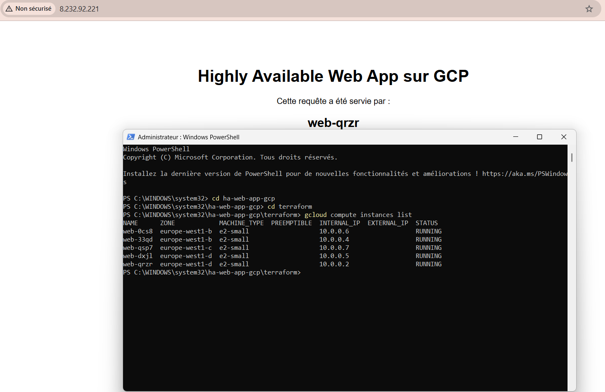
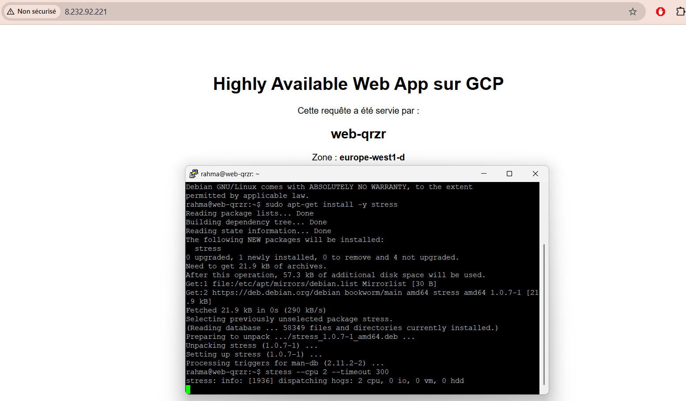
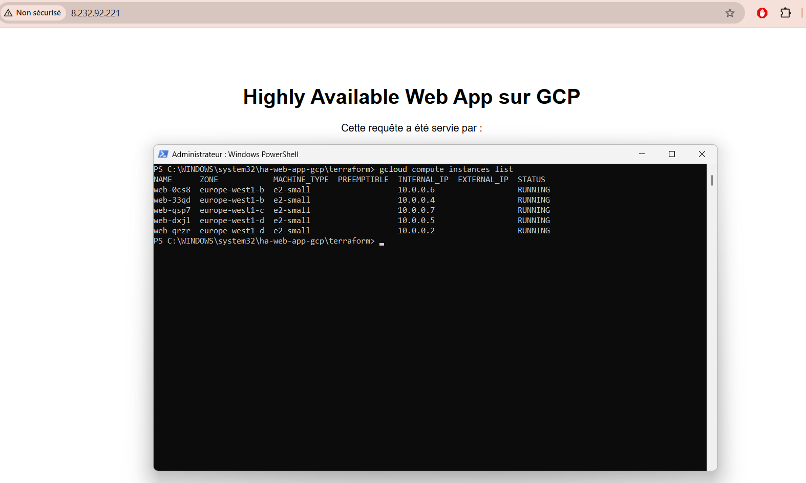
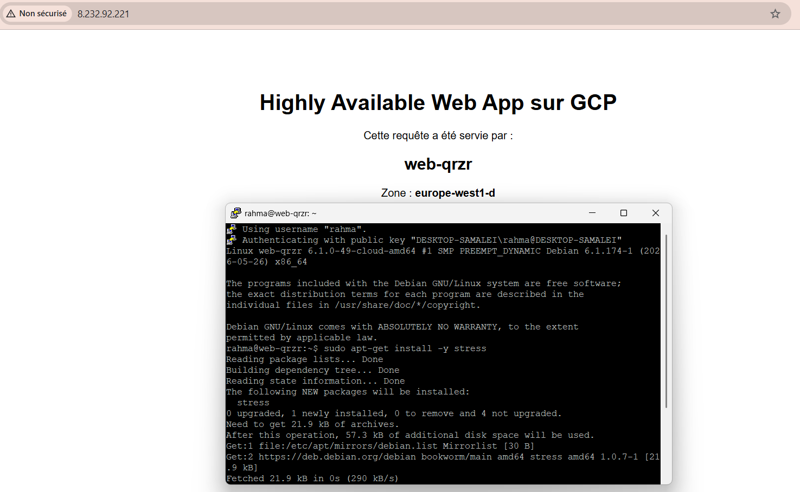
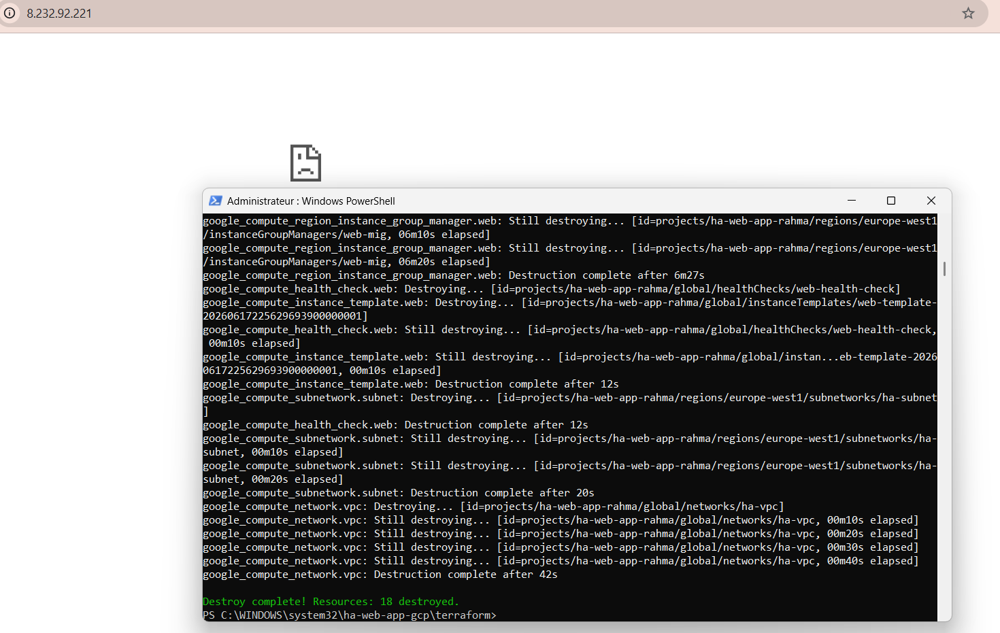

# Highly Available Web Application on Google Cloud

Production-style, fully Infrastructure-as-Code deployment of a highly available web tier on Google Cloud Platform, global HTTP(S) load balancing, a regional multi-zone managed instance group with autoscaling and autohealing, a private VPC with no public-facing VMs, Cloud NAT egress, IAP-based SSH, and a Cloud Armor security policy.

## Overview

This project provisions a horizontally scalable, self-healing web tier on GCP entirely through Terraform. The goal is not just "a server that serves a page" but a deployment that survives instance failure and zone failure, scales with load, and keeps the compute layer off the public internet, the baseline expectations for a production web tier.

Every resource is declarative and reproducible: the entire stack stands up with terraform apply and tears down with terraform destroy, leaving zero manual console steps and no orphaned billable resources.

## What this project demonstrates

Designing for high availability across failure domains (multi-zone, autohealing).
Elastic scaling driven by real load signals (CPU-based autoscaling).
Network security by default: private instances, least-privilege firewall rules, controlled egress, and zero exposed SSH.
Edge protection: global load balancing fronted by a Cloud Armor rate-limiting policy.
Infrastructure as Code discipline: modular configuration, externalized variables, ignored state/secrets, CI validation, and a clean deploy → validate → destroy lifecycle.

## Architecture

## Tech stack

Terraform · Google Cloud Platform (Compute Engine, VPC, Cloud Load Balancing, Cloud Armor, Cloud NAT, IAP, Cloud Monitoring) · Nginx on Debian 12 · GitHub Actions (CI).

## Repository structure

.
├── README.md
├── DECISIONS.md                 # Architecture Decision Records
├── .gitignore
├── .github/workflows/
│   └── terraform-checks.yml     # fmt + validate on every push
├── screenshots/                 # evidence (see "Validation" below)
└── terraform/
    ├── provider.tf              # provider + version pins
    ├── variables.tf
    ├── terraform.tfvars.example
    ├── network.tf               # VPC, subnet, Cloud NAT, firewall
    ├── compute.tf               # template, health check, MIG, autoscaler
    ├── loadbalancer.tf          # global LB chain + Cloud Armor
    ├── monitoring.tf            # uptime check
    ├── outputs.tf
    └── startup.sh               # Nginx bootstrap (serves instance + zone)

## Prerequisites

A GCP project with billing enabled
gcloud CLI (authenticated) and terraform ≥ 1.5
Required APIs enabled: compute, monitoring, iap

bashgcloud services enable compute.googleapis.com monitoring.googleapis.com iap.googleapis.com
gcloud auth application-default login

## Deployment

bashcd terraform
cp terraform.tfvars.example terraform.tfvars   # set your project_id
terraform init
terraform apply
terraform output -raw load_balancer_ip

Allow a few minutes for the load balancer to propagate and health checks to pass, then open the returned IP in a browser. The page reports the instance name and zone that served the request, refresh to observe traffic distribution.

## Validation: proving high availability

The following were verified on a live deployment. Evidence is in screenshots/.

1. Load balancing across zones

A loop of requests against the LB IP is served by different instances in different zones, confirming traffic distribution rather than a single backend.

2. Autohealing (instance-failure resilience)

An instance is deleted out-of-band (gcloud compute instances delete). The application stays reachable through the surviving instance, and the MIG automatically recreates the deleted VM to restore the desired state.

3. Autoscaling (load-driven elasticity)

CPU load is generated on an instance (stress --cpu 2). The autoscaler scales the group out toward its maximum (here, 5 instances spread across zones b/c/d), then scales back in once load subsides.

4. Secure access via IAP

SSH is performed through Identity-Aware Proxy (--tunnel-through-iap), no instance has a public IP and port 22 is never exposed to the internet.

5. Clean teardown

terraform destroy removes the entire stack (18 resources) in one command, and the load balancer IP becomes unreachable immediately afterwards, confirming no orphaned, billable resources are left behind.

## Lifecycle & cost discipline

This stack is designed to be stood up, validated, and torn down on demand rather than left running. The full lifecycle is a single, repeatable loop:

bashterraform apply     # provision the entire stack (2-3 min)
##  → validate HA: load balancing, autohealing, autoscaling, IAP access
terraform destroy   # remove all 18 resources (~7 min), zero residue

Because the infrastructure is fully described in code, it can be recreated identically at any time without leaving billable resources idle between sessions. The teardown was verified end-to-end (Destroy complete! Resources: 18 destroyed), and the public endpoint was confirmed unreachable afterwards.

### Practical cost notes

The stack uses small e2-small instances and standard load-balancing components; a short-lived demo runs comfortably within the GCP free-trial credit.
The global load balancer carries a small hourly charge, so it is torn down rather than kept running.
*.tfstate and *.tfvars are git-ignored, so no state or secrets are committed.

### Monitoring

A Cloud Monitoring uptime check probes the load balancer every 60 seconds. A custom dashboard (CPU utilization, instance count, LB request rate) makes the autoscaling event above directly observable. To receive alerts, attach a notification channel to an alert policy in the console.

### Security considerations

No public IPs on compute. Instances are unreachable directly from the internet; outbound access is brokered by Cloud NAT.
No exposed SSH. Administrative access is tunneled through IAP; the firewall only permits the IAP source range (35.235.240.0/20) on port 22.
Least-privilege ingress. Port 80 is allowed only from Google's load-balancer/health-check ranges (130.211.0.0/22, 35.191.0.0/16), not from 0.0.0.0/0.
Edge rate limiting. A Cloud Armor rate_based_ban policy throttles abusive clients before they reach the backend.

### Optional: TLS / HTTPS

The default deployment serves HTTP to remain reproducible without a domain. The HTTPS path (Google-managed SSL certificate, HTTPS proxy, and HTTP→HTTPS redirect) is documented and requires a domain whose DNS A-record points at the load balancer IP. 

See DECISIONS.md (ADR-008).